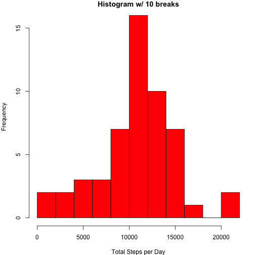
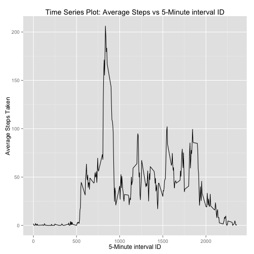
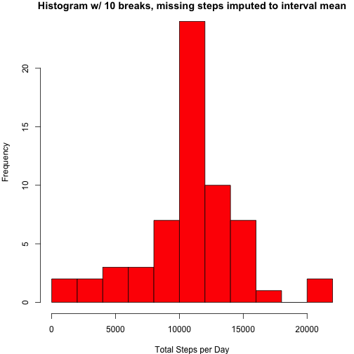
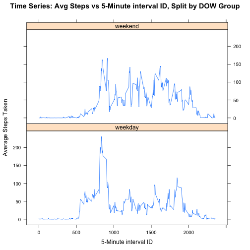

# @JohnsHopkinsSPH Reproducible Research: Peer Assessment 1
#### Author: cjesse01  
# Outline
- Pre-work
- Load and pre-process the data in R
- Four Analysis Tasks:  
  - A. What is mean total number of steps taken per day?  
  - B. What is the average daily activity pattern?   
  - C. Imputing missing values  
  - D. Are there differences in activity patterns between weekdays and weekends?  

## Pre-work:
- fork the GitHub repo:  
[https://github.com/rdpeng/RepData_PeerAssessment1](https://github.com/rdpeng/RepData_PeerAssessment1) with SHA-1 hash: dc20c7c4e92aea6af318a611e2669d5b9c6cbfaf
- clone the repo as the local Working Directory
- activity.zip comes with the clone
- unzip the data file to activity.csv into the local Working Directory
- load packages needed:  


```r
library(ggplot2)
library(lattice)
```

## Load and pre-process the data in R
### 1) Load the data using function read.csv()


```r
activity <- read.csv(
                     file="activity.csv" 
                     , header=TRUE 
                     , sep=","
                     , stringsAsFactors=FALSE
)
#str(activity) #17568 x 3: steps(int), date(chr, YYYY-MM-DD), #interval(int)
colnames(activity)[2] <- "DateChar"
```

### 2) Process/Transform data as needed
Note: Five new columns were created.  None of these are required to do the analyses. However, they were a fun academic acvtivity.  


```r
# create interval as a factor
activity$intervalFactor <- factor(activity$interval)
# create true date from character version
activity$Date <- as.Date(strptime(activity$DateChar, format="%Y-%m-%d"))
# create true time from interval ID
activity$Time <- as.POSIXct(
                        strptime(
                                paste(sprintf("%02d", floor(activity$interval/100))
                                    , sprintf("%02d", (activity$interval %% 100))
                                    , rep.int(sprintf("%02d",0), nrow(activity))
                                    , sep=":"
                                     )
                        , format="%H:%M:%S"
                                )
)
# create alternate time as char
activity$TimeChar <- strftime(activity$Time, format="%H:%M:%S")
# create true datetime from character Date and interval
activity$DateTime <- strptime(
                         paste(activity$DateChar, 
                          paste(sprintf("%02d", floor(activity$interval/100)) 
                              , sprintf("%02d", (activity$interval %% 100))
                              , rep.int(sprintf("%02d",0), nrow(activity))
                              , sep=":"
                               )
                            , sep=" "
                              )
                         , format="%Y-%m-%d %H:%M:%S"
)
#diagnostic
str(activity)
```

```
## 'data.frame':	17568 obs. of  8 variables:
##  $ steps         : int  NA NA NA NA NA NA NA NA NA NA ...
##  $ DateChar      : chr  "2012-10-01" "2012-10-01" "2012-10-01" "2012-10-01" ...
##  $ interval      : int  0 5 10 15 20 25 30 35 40 45 ...
##  $ intervalFactor: Factor w/ 288 levels "0","5","10","15",..: 1 2 3 4 5 6 7 8 9 10 ...
##  $ Date          : Date, format: "2012-10-01" "2012-10-01" ...
##  $ Time          : POSIXct, format: "2014-06-15 00:00:00" "2014-06-15 00:05:00" ...
##  $ TimeChar      : chr  "00:00:00" "00:05:00" "00:10:00" "00:15:00" ...
##  $ DateTime      : POSIXlt, format: "2012-10-01 00:00:00" "2012-10-01 00:05:00" ...
```

## A. What is mean total number of steps taken per day?
### A.1. Create histogram of the total number of steps taken each day
#### Prep the data:


```r
TotalStepsPerDay <- as.data.frame(
                         aggregate(steps ~ DateChar
                                 , data=activity
                                 , FUN="sum"
                                  )
)
colnames(TotalStepsPerDay)[2] <- "TotalSteps"
```

#### Create plot, using base functions par() and hist():


```r
par(mar=c(4,4,1,1))
hist(TotalStepsPerDay$TotalSteps 
   , main="Histogram w/ 10 breaks"
   , xlab="Total Steps per Day"
   , col="red"
   , breaks=10)
```

 

### A.2. Calculate/Report mean/median for total number of steps taken each day


```r
mean <- mean(TotalStepsPerDay$TotalSteps)
median <- median(TotalStepsPerDay$TotalSteps)
A2_report <- as.data.frame(cbind(mean,median))
names(A2_report) <- c("mean_TotalStepsPerDay","median_TotalStepsPerDay")
print(A2_report, digits=c(7,7))
```

```
##   mean_TotalStepsPerDay median_TotalStepsPerDay
## 1              10766.19                   10765
```

## B. What is the average daily activity pattern?
### B.1. Create time series plot average steps vs 5-minute interval
#### Prep the data:


```r
AvgStepsPerInterval <- as.data.frame(
                aggregate(
                          steps ~ interval + intervalFactor + Time + TimeChar
                          , data=activity
                          , FUN="mean"
                         )
)
colnames(AvgStepsPerInterval)[5] <- "AvgSteps"
```

#### Create plot, using ggplot2 function ggplot():


```r
library(ggplot2)
g <- ggplot(AvgStepsPerInterval
            , aes(x=interval, y=AvgSteps)
            )
g + geom_line() + 
        labs(y="Average Steps Taken") +
        labs(x="5-Minute interval ID") +
        labs(title="Time Series Plot: Average Steps vs 5-Minute interval ID") 
```

 

### B.2. Which 5-minute interval, averaged across all days, contains the maximum?


```r
AvgStepsPerInterval[
        which(
        AvgStepsPerInterval$AvgSteps==max(AvgStepsPerInterval$AvgSteps)
             )
        , c(1,4,5) ]
```

```
##     interval TimeChar AvgSteps
## 104      835 08:35:00    206.2
```

```r
# Maximum average steps of 206.2 occurs with interval ID 835, or the 5-minute interval starting at 08:35:00 AM
```

## C. Imputing missing values
### C.1. Calculate/Report NA profile in the dataset (row count w/ NA)


```r
# 1st 3 columns are the original data
colSums(is.na(activity[, c(1:3)])) 
```

```
##    steps DateChar interval 
##     2304        0        0
```

```r
# 2304 missing values for steps. No other missing values.
```

### C.2. Devise a strategy for imputing missing values
Based on initial data exploration, missing value imputation chosen for *steps* column:  

*the mean number of steps for the interval, across all days*  
#### Details of imputation:


```r
MeanStepsPerInterval <- as.data.frame(
        aggregate(steps ~ interval + intervalFactor + Time + TimeChar
                , data=activity
                , FUN="mean"
                 )
)
colnames(MeanStepsPerInterval)[5] <- "MeanSteps"
head(MeanStepsPerInterval[,c(1,4,5)], n=10)
```

```
##    interval TimeChar MeanSteps
## 1         0 00:00:00   1.71698
## 2         5 00:05:00   0.33962
## 3        10 00:10:00   0.13208
## 4        15 00:15:00   0.15094
## 5        20 00:20:00   0.07547
## 6        25 00:25:00   2.09434
## 7        30 00:30:00   0.52830
## 8        35 00:35:00   0.86792
## 9        40 00:40:00   0.00000
## 10       45 00:45:00   1.47170
```

### C.3. Create new dataset with missing value imputation
#### Create new dataset with imputed *newsteps* column:


```r
# separate the missing steps records from nonmissing
missStep <-    subset(activity,  is.na(activity$steps)) 
nonmissStep <- subset(activity, !is.na(activity$steps)) 

# create imputed newsteps in missStep
stepimpute <- MeanStepsPerInterval[, c("interval", "MeanSteps")]
missStep2 <- merge(missStep, stepimpute)
colnames(missStep2)[9] = "stepsnew"

# create newsteps in nonmissStep, simply a 1:1 map to steps
nonmissStep$stepsnew = nonmissStep$steps

# recombine the two halves
activityNEW<-rbind(nonmissStep,missStep2)
colSums(is.na(activityNEW)) #2304 missing steps value, but 0 for stepsnew
```

```
##          steps       DateChar       interval intervalFactor           Date 
##           2304              0              0              0              0 
##           Time       TimeChar       DateTime       stepsnew 
##              0              0              0              0
```

### C.4.a Create histogram of the total number of steps taken each day
#### Prep the data:


```r
TotalStepsPerDayNEW <- as.data.frame(
        aggregate(stepsnew ~ DateChar
                  , data=activityNEW
                  , FUN="sum"
                  )
)
colnames(TotalStepsPerDayNEW)[2] <- "TotalSteps"
```

#### Create plot, using base functions par() and hist():


```r
par(mar=c(4,4,1,1))
hist(TotalStepsPerDayNEW$TotalSteps, 
     main="Histogram w/ 10 breaks, missing steps imputed to interval mean",
     xlab="Total Steps per Day",
     col="red",
     breaks=10)
```

 

### C.4.b Calculate/Report mean/median for total number of steps taken each day


```r
mean <- mean(TotalStepsPerDayNEW$TotalSteps)
median <- median(TotalStepsPerDayNEW$TotalSteps)
C4b_report <- as.data.frame(cbind(mean,median))
names(C4b_report) <- c("mean_TotalStepsPerDay","median_TotalStepsPerDay")
print(C4b_report, digits=c(7,7)) 
```

```
##   mean_TotalStepsPerDay median_TotalStepsPerDay
## 1              10766.19                10766.19
```

### C.4.c Do values in C.4.b differ from those in A.2? 
#### Print the two reports, without and with imputation of missing *steps*


```r
# without imputation 
print(A2_report, digits=c(7,7))
```

```
##   mean_TotalStepsPerDay median_TotalStepsPerDay
## 1              10766.19                   10765
```

```r
# with imputation
print(C4b_report, digits=c(7,7)) #mean and median are now the same
```

```
##   mean_TotalStepsPerDay median_TotalStepsPerDay
## 1              10766.19                10766.19
```

#### Yes, imputation makes a difference to the median computation.

### C.4.d What is the impact of imputing NAs on the C.4.b estimates
By replacing missing *steps* with the average for the interval across all days, the mean and median are now the same.  The distribution is slightly more symmetric.

## D. Are there differences in activity patterns between weekdays and weekends?
### D.1. Create new factor variable with two levels - "weekday", "weekend"


```r
activityNEW = within(activityNEW,
        {
        DOWGroup = as.factor( 
                        ifelse(
                                (weekdays(activityNEW$Date, abbreviate=TRUE) 
                                %in% c("Sat","Sun")) 
                                , "weekend", "weekday"
                              )
                            )
        }
)
table(activityNEW$DOWGroup)
```

```
## 
## weekday weekend 
##   12960    4608
```

### D.2. Make a panel plot of the time series:
#### Plot requirements:
- y-axis: average number of steps
- x-axis: 5-minute interval ID
- one panel for each of the factor variable wih levels "weekday", "weekend"  

#### Prep the data:


```r
TotalStepsPerGRPNEW <- as.data.frame(
        aggregate(stepsnew ~ DOWGroup + interval + intervalFactor + Time + TimeChar
                , data=activityNEW
                , FUN="mean")
)
colnames(TotalStepsPerGRPNEW)[6] <- "AvgSteps"
```

#### Create plot using lattice function xyplot()


```r
library(lattice)
xyplot(
AvgSteps ~ interval | DOWGroup
, data=TotalStepsPerGRPNEW
, layout=c(1,2)
, main="Time Series: Avg Steps vs 5-Minute interval ID, Split by DOW Group"
, xlab="5-Minute interval ID"
, ylab="Average Steps Taken"
, type=c("l","l")
)
```

 

# FIN!
## Thank you for your Peer Assessment of my work... :)
